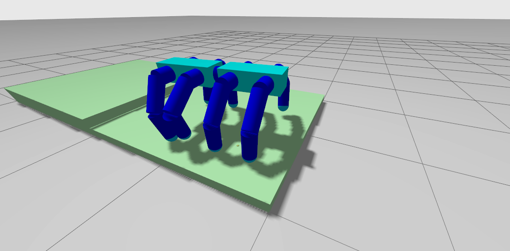
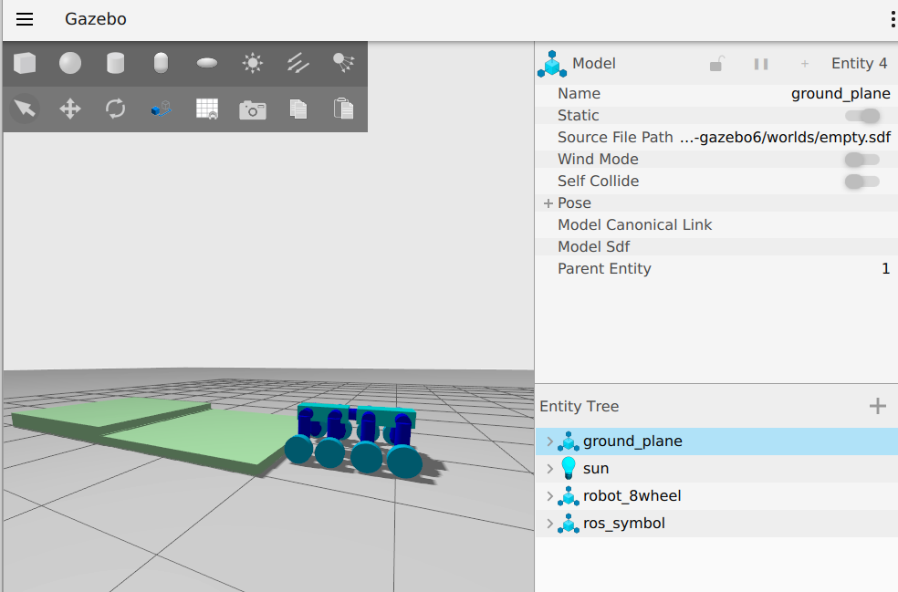
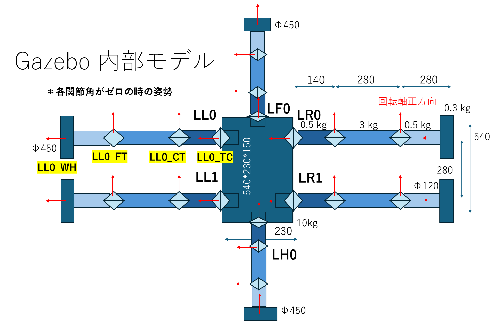
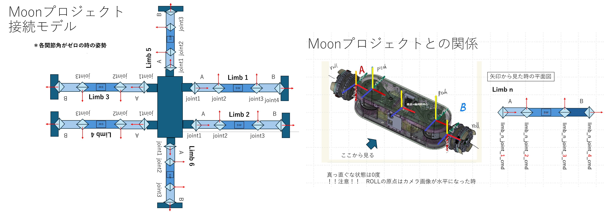

# MoonSim
## 初めに
このプログラムは，４脚 ８脚ロボットを，gazebo ignition を使って動かすためのプログラムです．
動作環境は以下です．
- [Ubuntu 22.04]()
- [ROS2(Robot Operation System 2) Humble](https://docs.ros.org/en/humble/index.html)
- [GZ Fortress (LTS)](https://gazebosim.org/docs/latest/ros_installation)

## 事前準備
### ROS2 Humble のインストール 
[公式サイト](https://docs.ros.org/en/humble/Installation/Ubuntu-Install-Debians.html)

### Gazebo Fortress のインストール
Gazeboをインストールします。以下のリンクに沿って、対応しているバージョンを入れてください。
https://gazebosim.org/docs/latest/ros_installation

公式がサポートしているバージョンをインストールする場合は、以下のコマンドを打つだけです。
```bash
sudo apt-get install ros-humble-ros-gz
```

その他，必要なものをインストールします．
ros control, python3, とか，要check
```bash
sudo apt install ros-humble-ign-ros2-control
sudo apt install python3
sudo apt install ros-humble-ros2-control
sudo apt install ros-humble-ros2-controllers
```

## プログラムコンパイル
このgit をクローンします．
```bash
git clone https://github.com/amby-1/MoonSim.git
```

フォルダ内部で，コンパイルして下さい
```bash
cd MoonSim
colcon build --packages-select ms_module_msgs
source install/setup.bash
colcon build
source install/setup.bash
```
(git に上げたファイルが過不足ないのかはまだ未検証)
いろいろエラーが出た場合は，指示に従って，いろいろ入れてください（すみません）

## プログラム実行
### 4Leg robot 
２つターミナルを立ち上げてください．１つ目でgazeboをたちあげ通ってますか？　ます
```bash
cd MoonSim
source install/setup.bash
ros2 launch robot_gazebo_ros2_control trajectory_controller_2.launch.py
```
これで，Gazeboが立ち上がり，４脚ロボットが出てきます．
エラーが出なければ正常です．ワーニングは出ます．
rvizも立ち上がるようにしてますが，設定はちゃんとしてないので，矢印だけ出てきます．

２つ目のターミナルで，ジョイントに位置指令を送り続けるノードを立ち上げます．
```bash
cd MoonSim
source install/setup.bash
ros2 run test_controller talker
```
うまくいって入れば，４つの脚が同期して上下に動くと思います．

gazebo の情報についても、新しいターミナルで以下のコマンドを打つことで、ROS と同じようにトピック情報を見ることができます。
```bash
ign topic -l
ign topic -e -t /world/empty/clock
```

### 8Leg robot 
３つターミナルを立ち上げてください．１つ目でgazeboをたちあげます
```bash
cd MoonSim
source install/setup.bash
ros2 launch robot_gazebo_ros2_control trajectory_controller_8leg.launch.py
```
これで，Gazeboが立ち上がり，8脚ロボットが出てきます．
更に、ステップ上の環境も出てくると思います。
エラーが出なければ正常です．ワーニングは出ます．
rvizも立ち上がるようにしてますが，設定はちゃんとしてないので，矢印だけ出てきます．

２つ目のターミナルで，moonshot用のメッセージをガゼボ用メッセージに変換してくれるインターフェースノードを立ち上げます．
```bash
cd MoonSim
source install/setup.bash
ros2 run ms_gazebo_interfaces interface_8leg_node
```

３つ目のターミナルで、サンプルのmoonshot用のコマンド司令ノードを立ち上げます。
```bash
cd MoonSim
source install/setup.bash
ros2 run ms_gazebo_interfaces limb_cmd_node
```

うまくいって入れば，前２つの脚が動くと思います．


ロボットを歩かせるサンプルプログラムを実行する場合は、３つ目のターミナルで以下のコマンド司令ノードを立ち上げます。
```bash
cd MoonSim
source install/setup.bash
ros2 run ms_gazebo_interfaces limb_cmd_8leg
```
Wave歩容を使って、ロボットが歩くと思います。




### 8Wheels robot 
３つターミナルを立ち上げてください．１つ目でgazeboをたちあげます
```bash
cd MoonSim
source install/setup.bash
ros2 launch robot_gazebo_ros2_control trajectory_controller_8wheel.launch.py
```
これで，Gazeboが立ち上がり，8 wheel ロボットが出てきます．
更に、ステップ上の環境も出てくると思います。
エラーが出なければ正常です．ワーニングは出ます．
rvizも立ち上がるようにしてますが，設定はちゃんとしてないので，矢印だけ出てきます．

２つ目のターミナルで，moonshot用のメッセージをガゼボ用メッセージに変換してくれるインターフェースノードを立ち上げます．
```bash
cd MoonSim
source install/setup.bash
ros2 run ms_gazebo_interfaces interface_8wheels_node
```

３つ目のターミナルで、サンプルのmoonshot用のコマンド司令ノードを立ち上げます。
```bash
cd MoonSim
source install/setup.bash
ros2 run ms_gazebo_interfaces limb_cmd_8wheels
```

This will make the robot moves with wheels. 
When the robot detects stacking, the simulation ends. 




The node "limb_cmd_8wheels" corresponds to the code "limb_module_cmd_node_8wheels.cpp". 
By editing this code, you can arrange the movement of the robot. 

Somehow, the robot turns gradually even the rotating speeds of left and right wheels are the same. 
I have not found any bugs related to the controller. I think this is a result of physical simulation. The ground reaction forces of the left and right side should be different. 

### 6 Limb wheels robot

３つターミナルを立ち上げてください．１つ目でgazeboをたちあげます
```bash
cd MoonSim
source install/setup.bash
ros2 launch robot_gazebo_ros2_control trajectory_controller_6wheel.launch.py
```
これで，Gazeboが立ち上がり，6Limb wheel ロボットが出てきます．
エラーが出なければ正常です．ワーニングは出ます．
rvizも立ち上がるようにしてますが，設定はちゃんとしてないので，矢印だけ出てきます．

２つ目のターミナルで，moonshot用のメッセージをガゼボ用メッセージに変換してくれるインターフェースノードを立ち上げます．
```bash
cd MoonSim
source install/setup.bash
ros2 run ms_gazebo_interfaces interface_6wheels_node
```

３つ目のターミナルで、サンプルのmoonshot用のコマンド司令ノードを立ち上げます。
```bash
cd MoonSim
source install/setup.bash
ros2 run ms_gazebo_interfaces limb_cmd_6wheels 
```

ロボットがゆっくり立ち上がって，進む様子が出てくると思います．

＊追記
車輪も位置制御で行う　＋　ジョイント角を手に入れる　を更新したノードを立ち上げるにはこちらを実行してください
```bash
ros2 run ms_gazebo_interfaces limb_cmd_6wheels_posver
```
説明は後ろに書きます．

### 5 Limb wheels robot

３つターミナルを立ち上げてください．１つ目でgazeboをたちあげます
```bash
cd MoonSim
source install/setup.bash
ros2 launch robot_gazebo_ros2_control trajectory_controller_5wheel.launch.py
```
これで，Gazeboが立ち上がり，6Limb wheel ロボットが出てきます．
エラーが出なければ正常です．ワーニングは出ます．
rvizも立ち上がるようにしてますが，設定はちゃんとしてないので，矢印だけ出てきます．

２つ目のターミナルで，moonshot用のメッセージをガゼボ用メッセージに変換してくれるインターフェースノードを立ち上げます．
```bash
cd MoonSim
source install/setup.bash
ros2 run ms_gazebo_interfaces interface_5wheels_node
```

３つ目のターミナルで、サンプルのmoonshot用のコマンド司令ノードを立ち上げます。
```bash
cd MoonSim
source install/setup.bash
ros2 run ms_gazebo_interfaces limb_cmd_5wheels 
```

ロボットがゆっくり立ち上がって，進む様子が出てくると思います．


## プログラムの説明　（8Leg）
### ノード接続図
ノードの接続図を示します．


このノード群は，大きくは A: Gazebo に関わる部分，B: joint_trajectory_controller に関わる部分，C: moonshot型に変更するインターフェース部分に大別されます．

### Gazebo関係
Gazeboに関係する部分では，Gazebo内に作られた8脚ロボット（src/robot_gazebo_ros2_control/urdf で定義）の物理シミュレーションを行い，ROS2との連携機能を提供します．内部はよくわかりませんが，`/parameter_events`というトピックを通してROS２に機能を提供しているようです．
ロボットの定義はURDFで行っており，パラメタ等を変えたい場合は `src/robot_gazebo_ros2_control/urdf/robot_8leg.urdf`をいじる必要があります．これはxacroから作られておりxacroファイルをいじったほうが良いが，ここら辺の説明はTODO．

The obstacles on the world is defined in `src/robot_gazebo_ros2_control/field/step.sdf`. 
You can add or change the obstacles by editing this file. 

Those robot and field are spawned by launch file. For each type of robot model, we need launch file such as `src/robot_gazebo_ros2_control/launch/robot_trajectory_controller_8leg.sdf`

ロボットの座標系や物理パラメタは下記図を参考


### joint trajectory controller関係
joint_trajectory_controller　に関係する部分では，８脚ロボットの各ジョイントを，`ros2 control` の `joint_trajectory_controller`の位置制御機能をつかって制御します．
具体的には，topic `/joint_trajectory_controller/joint_trajectory`によって位置指令を受け取り，GazeboシミュレータにPD制御で得られるトルク指令を送っています．
このＰＤゲインは，`src/robot_gazebo_ros2_control/config/robot_trajectory_controller_8leg.yaml`内部で設定しています．このジョイントの名づけ定義は前図を参考ください

### moonshot型へのインターフェース関係
これ関係のノードは，`ms_gz_interface_8leg`である．
このノードは，moonshotで開発しているジョイント角指令トピック `/limb_n_1/joint/joint_cmd_list` を受け取り， `/joint_trajectory_controller/joint_trajectory`に変換して joint trajectory controllerへの指令を出します．
moonshot型のメッセージは，`src/ms_module_msgs`内に定義してあり，このインターフェースでは， joint_cmd_list　のIDは下記図の通りと思って実装してあります．
なお，このプログラムは制御周波数は 50Hz でデザインしています．


Efforts value (Torque Nm) of each joint is estimated from the PD gains and joind deviation. 
Only for 8 Legged and wheeled robot model, this estimation is available. 

### 関節角を指令するサンプルノード
`limb_module_cmd_node`(`src/ms_gazebo_interfaces/src/limb_module_cmd_node.cpp`)では，関節角を指令するサンプルノードとなっている．
この内部を書き換えて指令を変えることで，８脚ロボットを位置制御で動かすことができる．

サンプルプログラムを見て頂けばわかるが，以下のように，まず，CModule_Joint_CMDクラスを，limb番号（例では1）とjoint番号(例では3)とともに作成する．
```c++
auto limb_1_joint_3_cmd_ = CModule_Joint_CMD(publisher_id_, "limb", "n", 1, "", "", 3);
```
次に，このクラスのcreate関数をつかって，目標関節角(limb_1_joint_3_target_angle) [deg] を入れてメッセージを作成，JoinCmdListにpush_backする
```c++
auto limb_1_joint_3_cmd_msg = limb_1_joint_3_cmd_.create_position_cmd_msg(node_, limb_1_joint_3_target_angle);
...
ms_module_msgs::msg::JointCmdList cmd;
cmd.joint_cmd_list.push_back(limb_1_joint_3_cmd_msg);
```
あとは，これをpublishすれば指令が送られます．

## プログラムの説明　（6Limb wheels）
基本的には8脚と同じなので，ここではロボットのパラメタと，座標系の定義だけを共有します．


moonショット型のジョイント角の定義は以下です．




位置制御とセンシングを行うノードのプログラムはこちらです．
基本的には，このインターフェースで実機と通信できるので（モジュールIDなどは調整必要），これに合わせてノードを作れば大丈夫と思います．
'''limb_module_cmd_node_6wheels_posver.cpp'''
指令もセンシングも単位は　度　です．

## プログラムの説明　（5Limb wheels）
Basically, this program eliminate LH limb from 6Limb simulation. I am sorry that I would like to skip the explanation at this moment. Please refer the explanation of 6 wheeled Llimb


## TODO
- ガゼボのODOMで位置を取得しているが、二次元平面でしか出てこない。ｚ座標が取れない
- ロボットのタッチセンサがうまくできていない　力を取得するなり考えないと行けない


