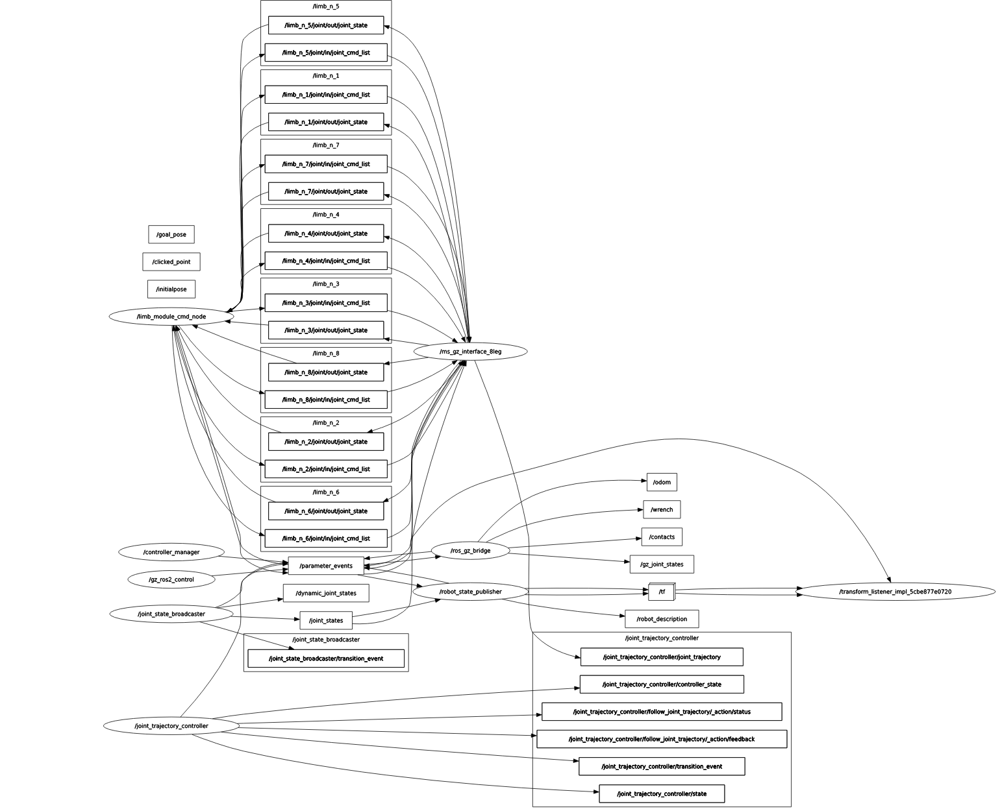
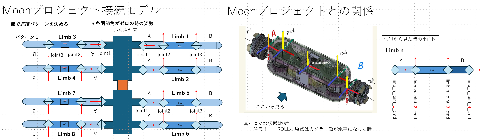

# MoonSim
## 初めに
このプログラムは，４脚 ８脚ロボットを，gazebo ignition を使って動かすためのプログラムです．
動作環境は以下です．
- [Ubuntu 22.04]()
- [ROS2(Robot Operation System 2) Humble](https://docs.ros.org/en/humble/index.html)
- [GZ Fortress (LTS)](https://gazebosim.org/docs/latest/ros_installation)

## 事前準備
### ROS2 Humble のインストール 
[公式サイト](https://docs.ros.org/en/humble/Installation/Ubuntu-Install-Debians.html)

### Gazebo Fortress のインストール
Gazeboをインストールします。以下のリンクに沿って、対応しているバージョンを入れてください。
https://gazebosim.org/docs/latest/ros_installation

公式がサポートしているバージョンをインストールする場合は、以下のコマンドを打つだけです。
```bash
sudo apt-get install ros-humble-ros-gz
```

その他，必要なものをインストールします．
ros control, python3, とか，要check
```bash
sudo apt install ros-humble-ign-ros2-control
sudo apt install python3
```

## プログラムコンパイル
このgit をクローンします．
```bash
git clone https://github.com/amby-1/MoonSim.git
```

フォルダ内部で，コンパイルして下さい
```bash
cd MoonSim
colcon build
source install/setup.bash
```
(git に上げたファイルが過不足ないのかはまだ未検証)
いろいろエラーが出た場合は，指示に従って，いろいろ入れてください（すみません）

## プログラム実行
### 4Leg robot 
２つターミナルを立ち上げてください．１つ目でgazeboをたちあげます
```bash
cd MoonSim
source install/setup.bash
ros2 launch robot_gazebo_ros2_control trajectory_controller_2.launch
```
これで，Gazeboが立ち上がり，４脚ロボットが出てきます．
エラーが出なければ正常です．ワーニングは出ます．
rvizも立ち上がるようにしてますが，設定はちゃんとしてないので，矢印だけ出てきます．

２つ目のターミナルで，ジョイントに位置指令を送り続けるノードを立ち上げます．
```bash
cd MoonSim
source install/setup.bash
ros2 run test_controller talker
```
うまくいって入れば，４つの脚が同期して上下に動くと思います．

gazebo の情報についても、新しいターミナルで以下のコマンドを打つことで、ROS と同じようにトピック情報を見ることができます。
```bash
ign topic -l
ign topic -e -t /world/empty/clock
```

### 8Leg robot 
３つターミナルを立ち上げてください．１つ目でgazeboをたちあげます
```bash
cd MoonSim
source install/setup.bash
ros2 launch robot_gazebo_ros2_control trajectory_controller_8leg.launch
```
これで，Gazeboが立ち上がり，8脚ロボットが出てきます．
エラーが出なければ正常です．ワーニングは出ます．
rvizも立ち上がるようにしてますが，設定はちゃんとしてないので，矢印だけ出てきます．

２つ目のターミナルで，moonshot用のメッセージをガゼボ用メッセージに変換してくれるインターフェースノードを立ち上げます．
```bash
cd MoonSim
source install/setup.bash
ros2 run ms_gazebo_interfaces interface_8leg_node
```

３つ目のターミナルで、サンプルのmoonshot用のコマンド司令ノードを立ち上げます。
```bash
cd MoonSim
source install/setup.bash
ros2 run ms_gazebo_interfaces limb_cmd_node
```

うまくいって入れば，前２つの脚が動くと思います．


## プログラムの説明　（8Leg）
### ノード接続図
ノードの接続図を示します．



このノード群は，大きくは A: Gazebo に関わる部分，B: joint_trajectory_controller に関わる部分，C: moonshot型に変更するインターフェース部分に大別されます．

### Gazebo関係
Gazeboに関係する部分では，Gazebo内に作られた8脚ロボット（src/robot_gazebo_ros2_controlで定義）の物理シミュレーションを行い，ROS2との連携機能を提供します．内部はよくわかりませんが，`/parameter_events`というトピックを通してROS２に機能を提供しているようです．
ロボットの定義はURDFで行っており，パラメタ等を変えたい場合は `src/robot_gazebo_ros2_control/urdf/robot_8leg.urdf`をいじる必要があります．これはxacroから作られておりxacroファイルをいじったほうが良いが，ここら辺の説明はTODO．
ロボットの座標系や物理パラメタは下記図を参考


### joint trajectory controller関係
joint_trajectory_controller　に関係する部分では，８脚ロボットの各ジョイントを，`ros2 control` の `joint_trajectory_controller`の位置制御機能をつかって制御します．
具体的には，topic `/joint_trajectory_controller/joint_trajectory`によって位置指令を受け取り，GazeboシミュレータにPD制御で得られるトルク指令を送っています．
このＰＤゲインは，`src/robot_gazebo_ros2_control/config/robot_trajectory_controller_8leg.yaml`内部で設定しています．このジョイントの名づけ定義は前図を参考ください

### moonshot型へのインターフェース関係
これ関係のノードは，`ms_gz_interface_8leg`である．
このノードは，moonshotで開発しているジョイント角指令トピック `/limb_n_1/joint/joint_cmd_list` を受け取り， `/joint_trajectory_controller/joint_trajectory`に変換して joint trajectory controllerへの指令を出します．
moonshot型のメッセージは，`src/ms_module_msgs`内に定義してあり，このインターフェースでは， joint_cmd_list　のIDは下記図の通りと思って実装してあります．
なお，このプログラムは制御周波数は 50Hz でデザインしています．



### 関節角を指令するサンプルノード
`limb_module_cmd_node`(`src/ms_gazebo_interfaces/src/limb_module_cmd_node.cpp`)では，関節角を指令するサンプルノードとなっている．
この内部を書き換えて指令を変えることで，８脚ロボットを位置制御で動かすことができる．

サンプルプログラムを見て頂けばわかるが，以下のように，まず，CModule_Joint_CMDクラスを，limb番号（例では1）とjoint番号(例では3)とともに作成する．
```c++
auto limb_1_joint_3_cmd_ = CModule_Joint_CMD(publisher_id_, "limb", "n", 1, "", "", 3);
```
次に，このクラスのcreate関数をつかって，目標関節角(limb_1_joint_3_target_angle) [deg] を入れてメッセージを作成，JoinCmdListにpush_backする
```c++
auto limb_1_joint_3_cmd_msg = limb_1_joint_3_cmd_.create_position_cmd_msg(node_, limb_1_joint_3_target_angle);
...
ms_module_msgs::msg::JointCmdList cmd;
cmd.joint_cmd_list.push_back(limb_1_joint_3_cmd_msg);
```
あとは，これをpublishすれば指令が送られます．

## TODO
センシング関係のトピックがまだない

